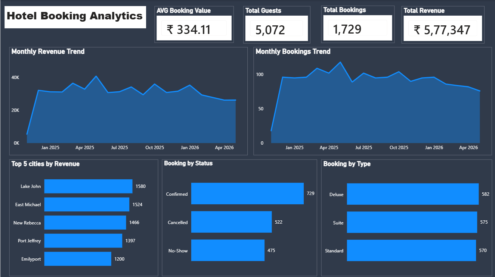

# Hotel Booking Analytics | Snowflake SQL + Power BI

## Project Overview

This project focuses on analyzing hotel booking data to generate business insights related to revenue, booking trends, city performance, and customer booking behavior.

The project uses **Snowflake** for data ingestion, data cleaning, SQL transformations, and analytical data preparation. **Power BI** is used to create an interactive dashboard for business reporting and visualization.

## Business Problem

The hotel had raw and inconsistent booking data with limited visibility into:

- Revenue performance
- Booking trends
- City-level revenue contribution
- Booking patterns
- Key business metrics

Management required a dashboard solution to quickly analyze performance and support data-driven decision-making.

## Objectives

- Clean and standardize raw booking data
- Handle missing values and inconsistent records
- Prepare analytics-ready datasets
- Analyze revenue trends
- Analyze booking trends
- Identify top revenue-generating cities
- Analyze bookings by room type and status
- Display important business KPIs

## Tech Stack

| Technology | Purpose |
|------------|---------|
| Snowflake | Data storage, SQL transformations, data warehousing |
| SQL | Data cleaning and analytics queries |
| Power BI | Dashboard development and visualization |
| CSV | Source dataset |

## Project Architecture

CSV Dataset
      |
      ↓
Snowflake Stage
      |
      ↓
Bronze Layer
(Raw Data)
      |
      ↓
Silver Layer
(Data Cleaning & Standardization)
      |
      ↓
Gold Layer
(Business Analytics Tables)
      |
      ↓
Power BI Dashboard
(Visualization & Reporting)

# Data Processing Workflow
## Bronze Layer - Raw Data
The raw CSV dataset was loaded into Snowflake using:

- File format configuration
- Snowflake stage
- COPY INTO command

The Bronze layer stores the original ingested data without major transformations.

## Silver Layer - Data Cleaning
Data quality checks and transformations were performed:

- Converted date columns into proper date format
- Standardized city names
- Standardized customer names
- Validated email formats
- Removed invalid date records
- Corrected inconsistent booking status values
- Handled negative revenue values

## Gold Layer - Analytics Tables
Business-ready tables were created for reporting:

- Revenue analysis
- Booking trends
- City revenue performance
- Room type analysis
- Booking status analysis
- KPI calculations

# Dashboard Features
The Power BI dashboard includes:

### Revenue Analysis
- Revenue trend over time
- Total revenue KPI

### Booking Analysis
- Booking trend analysis
- Total booking KPI

### City Performance
- Top revenue-generating cities

### Booking Insights
- Bookings by room type
- Bookings by booking status

# Key Performance Indicators (KPIs)

The dashboard displays:
- Total Revenue
- Total Bookings
- Average Booking Value
- Total Guests

# Dashboard Preview

# Key Learnings

Through this project, I gained experience in:

- Snowflake data loading
- SQL-based data transformation
- Data quality validation
- Bronze-Silver-Gold data architecture
- Business KPI development
- Power BI dashboard creation
- Data storytelling and visualization

# Future Improvements

Possible enhancements:

- Implement automated data ingestion using Snowpipe
- Add incremental data loading
- Schedule transformations using Snowflake Tasks
- Add advanced customer segmentation
- Build predictive analytics models

## Project Files

hotel-booking-analytics-snowflake-powerbi
│
├── sql
│   └── hotel_booking_analytics.sql
│
├── powerbi
│   └── Hotel_Booking_Analytics.pbix
│
├── images
│   └── dashboard.png
│
└── docs
    └── Business_Requirements_Document.pdf

# Note:
*Snowflake's legacy dashboard functionality is no longer available. In this project, **Snowflake** was used for data ingestion, SQL transformations, and data warehousing, while **Power BI** was used as the business intelligence layer to create interactive dashboards and reports.

*Snowflake also supports **Streamlit in Snowflake**, which allows developers to build interactive data applications and dashboards using Python. However, **Power BI** was selected for this project to demonstrate a commonly used industry architecture where Snowflake serves as the data warehouse and Power BI provides visualization and reporting capabilities.
